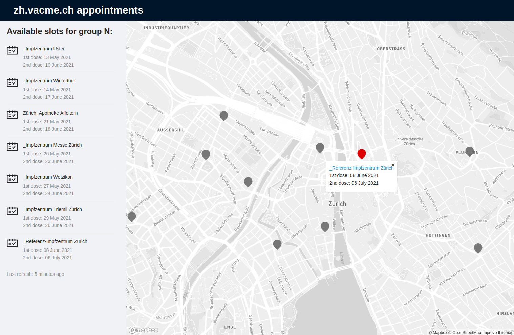

# vacme-zurich-parser

https://zh.vacme.ch provides a way to register for vaccination in Zurich. Since there is not much free slots - its quite tedious to find available one. Recently dropdown was updated to filter not available ones, but unfortunately active options often dont have slots either.    

This service (https://vacme.kloud.top) tries to simplify search by exposing rest api and UI with up to date available slots for vaccination in Zurich.  
Be aware is uses personal refresh token for existing registration and reverse engineered api, so its all quite fragile - any next update of vacme.ch can break it.  

Main part if you want to reuse code is in `parser` folder. Its python app which periodically calls `zh.vacme.ch`, and exposes basic api for UI and caching layers.  
Python is not my primary language, so I have no idea what I'm doin.. ¯\_(ツ)_/¯  
Its was just jupiter experiment (see original `vaccination_search.ipynb`) wrapped into api and extended with token refresh.  

(If you are developing `zh.vacme.ch` and my requests bother you - just create issue here, and I will stop crawling)

Currently, deployed to https://vacme.kloud.top with refresh interval 5 min and with my account for group `N`.

zh.vacme.ch is for Zurich only, please check other cantons on https://foph-coronavirus.ch/vaccination/when-can-i-be-vaccinated/#cantons 

Stay safe! ;)

UPD: I've found similar service https://rimpfli.web.app - check it out as well. It has Bern in addition to Zurich and notifications! 



## possible todo
- [ ] notifications in UI (?)
- [ ] contact locations to get an info of which vaccine is in use there (?)
- [ ] store/show statistics about slots per day etc
- [ ] automatic SMS login 

## API

Here is main caching flat api providing appointment data and geo `https://vacme.kloud.top/api/v2/locations` for UI display.  
Example response: 
```json
{
  "vaccination_group": "N",
  "last_refresh": 1621085095601,
  "refresh_interval_sec": 250,
  "locations": [
    {
      "name": "Zürich, TopPharm Morgental Apotheke",
      "id": "00d65270-264f-469f-bdac-765d01d2b14c",
      "noFreieTermine": true,
      "latitude": 47.3437185858769,
      "longitude": 8.529828454511142,
      "link": "https://goo.gl/maps/8VFBvGnSGrZJLHW98"
    },
    {
      "name": "Affoltern, Amavita Apotheke Affoltern a. A.",
      "id": "02a43092-5990-44f7-9d28-2b7414668347",
      "noFreieTermine": true,
      "latitude": 47.27729486909392,
      "longitude": 8.44968738334539,
      "link": "https://g.page/amavita-affoltern-am-albis"
    },
    .....
  ]
}
```

`noFreieTermine` and `id` fields are propagated from `vacme.ch` directly. 

See parser only api in `parser` folder. 

## local deployment
if you want to run it locally, find your REGISTRATION_ID and REFRESH_TOKEN from browser network tab and run:
```bash
docker run --rm -it -e REGISTRATION_ID=? -e REFRESH_TOKEN=? golonzovsky/vacme-parser
```

or run python code directly.

## cloud deployment
In case you want to run it in the cloud - sometimes api starts to redirect into captcha. AFAIK once captcha is solved - IP is added, and you can call vacme again.  

If you run in k8s - you need to hide your nodes behind NAT. Then you can to solve captcha from behind NAT ip using socks proxy. Example to create local SOCKS proxy from private GKE node:
```
gcloud beta compute ssh --zone "europe-west6-a" "gke-main-preemptible-e2-medium-3b140cfc-wv1s" --tunnel-through-iap -- -N -p 22 -D localhost:5000
```
UPD: added all infra code, see https://github.com/golonzovsky/vacme-zurich-parser/tree/main/infrastructure folder. Its terraform definitions of GKE cluster and things around running in GCP. 
