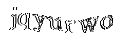

# vacme-zurich-parser

## login and auth 
https://zh.vacme.ch seems to be using [Keycloak](https://www.keycloak.org) to expose OpenID flow and some enterprisish looking [FortiADC](https://www.fortinet.com/products/application-delivery-controller/fortiadc) for.. mm, probably captcha and some WAF? 

Call to `https://zh.vacme.ch/auth/realms/vacme/protocol/openid-connect/token` lets to refresh token.

Token is valid for 5 min, refresh_token is valid for 30 min. So try to avoid 5 min refresh interval, unless to are ready to get 401 and refresh token on any request.  

Site does logout once per day no matter how often you refresh tokens. This will require SMS code.

Around once a day (or for any new ip) you need to solve captcha. Example:

`https://zh.vacme.ch/captcha/fortiadc_captcha_image?random=0.7206128283432224&change=0`  
  
https://docs.fortinet.com/document/fortiadc/6.0.1/handbook/36676/configuring-captcha

## appoinment search 

### list locations
Dropdown list of locations is fetched by: `https://zh.vacme.ch/api/v1/reg/dossier/odi/all/{}` with your registration ID in the end. So maybe your `Vaccination group` might affect this list content.  
No idea if those IDs are stable, therefore I rely on names.. 

### appointment select
`https://zh.vacme.ch/api/v1/reg/dossier/termine/nextfrei/{}/ERSTE_IMPFUNG` with locaiton_id and then `https://zh.vacme.ch/api/v1/reg/dossier/termine/nextfrei/{}/ZWEITE_IMPFUNG` with location id and response from first one in body.

## API

Currently json api for available slots for both appointments available under https://vacme.kloud.top/api
Example response:
```json
{
  "last_refresh": 1620671956765,
  "locations": [
    {
      "firstDate": 1620993600000,
      "name": "_Impfzentrum Winterthur",
      "secondDate": 1623844800000
    }
  ],
  "refresh_interval_sec": 600,
  "source": "https://github.com/golonzovsky/vacme-zurich-parser",
  "vaccination_group": "N"
}
```

List all locations (will cleanup fields) https://vacme.kloud.top/api/locations:
```json
[
    {
      "glnNummer": "7601001326460",
      "id": "00d65270-264f-469f-bdac-765d01d2b14c",
      "mobilerOrtDerImpfung": false,
      "name": "Zürich, TopPharm Morgental Apotheke",
      "noFreieTermine": true,
      "terminverwaltung": true,
      "timestampErstellt": "2021-04-30T14:35:15",
      "timestampMutiert": "2021-05-12T22:10:00",
      "userErstellt": "f7c43312-7245-429e-96b9-a615b989522a",
      "userMutiert": "f7c43312-7245-429e-96b9-a615b989522a",
      "version": 1
    },
    {
      "glnNummer": "7601001368712",
      "id": "02a43092-5990-44f7-9d28-2b7414668347",
      "mobilerOrtDerImpfung": false,
      "name": "Affoltern, Amavita Apotheke Affoltern a. A.",
      "noFreieTermine": true,
      "terminverwaltung": true,
      "timestampErstellt": "2021-04-30T09:23:32",
      "timestampMutiert": "2021-05-12T22:10:00",
      "userErstellt": "f7c43312-7245-429e-96b9-a615b989522a",
      "userMutiert": "f7c43312-7245-429e-96b9-a615b989522a",
      "version": 1
    }
...
]
```